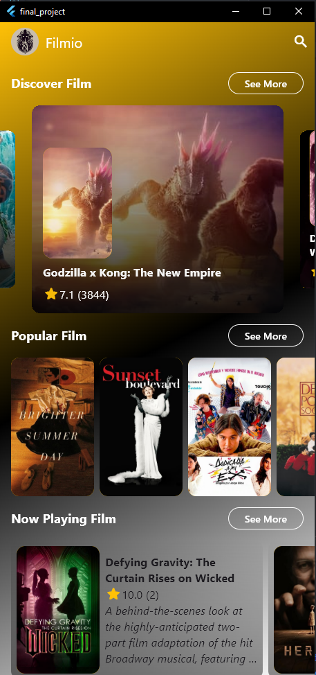

# Filmio

Filmio is a Flutter application for browsing and discovering movies. The app fetches movie data from the TMDB (The Movie Database) API, allowing users to explore popular movies, view detailed information about films, and search for specific titles.

---

## Preview



---

## Features
- 🎥 **Discover Film**: Browse newly released movies.
- 🔍 **Popular Film**: Explore trending movies.
- 📄 **Now Playing Film**: View movies currently playing in theaters.
- 🎭 **Dynamic Data**: Real-time updates from TMDB API.
- 📜 **Detail Film**: View comprehensive movie details.
- 🔎 **Search Film**: Search for movies by title.
- 🌐 **Web Official**: Access the official website of each movie.

---

## Getting Started

### **Prerequisites**
Before starting, ensure you have the following tools installed on your system:
- [Flutter SDK](https://flutter.dev/docs/get-started/install)
- [Dart](https://dart.dev/get-dart)
- Code editor (recommended: [VS Code](https://code.visualstudio.com/) or [Android Studio](https://developer.android.com/studio))
- Android/iOS emulator or a physical device for testing

### **Installation**
1. Clone this repository:
   ```bash
   git clone https://github.com/your-username/filmio.git
   ```
2. Navigate to the project directory:
   ```bash
   cd filmio
   ```
3. Get all the dependencies:
   ```bash
   flutter pub get
   ```
4. Run the application:
   ```bash
   flutter run
   ```
   Make sure your emulator or physical device is connected and ready.

---

## TMDB API Integration

To fetch movie data, this project uses the TMDB API. Follow these steps to set up the API key:

1. Sign up for an account on [TMDB](https://www.themoviedb.org/).
2. Go to your account settings and generate an API key.
3. Create a file named `.env` in the project directory and add your API key:
   ```env
   API_KEY=your_tmdb_api_key
   ```
4. Update the `constant.dart` file in the project to use this key.

---

## Models Used

### 1. **Movie Model**
The `ModelFilm` class represents the movie data fetched from the TMDB API, while `ModelFilmResponse` handles the paginated response containing multiple movies.

<details>
<summary>Click to expand Movie Model Code</summary>

```dart
// Movie response and model classes
import 'dart:convert';

ModelFilmResponse modelFilmResponseFromJson(String str) => ModelFilmResponse.fromJson(json.decode(str));

String modelFilmResponseToJson(ModelFilmResponse data) => json.encode(data.toJson());

class ModelFilmResponse {
    int page;
    List<ModelFilm> results;
    int totalPages;
    int totalResults;

    ModelFilmResponse({
        required this.page,
        required this.results,
        required this.totalPages,
        required this.totalResults,
    });

    factory ModelFilmResponse.fromJson(Map<String, dynamic> json) => ModelFilmResponse(
        page: json["page"] ?? 0,
        results: List<ModelFilm>.from(json["results"].map((x) => ModelFilm.fromJson(x ?? {}))),
        totalPages: json["total_pages"] ?? 0,
        totalResults: json["total_results"] ?? 0,
    );

    Map<String, dynamic> toJson() => {
        "page": page,
        "results": List<dynamic>.from(results.map((x) => x.toJson())),
        "total_pages": totalPages,
        "total_results": totalResults,
    };
}

class ModelFilm {
    String backdropPath;
    int id;
    String overview;
    String posterPath;
    String title;
    double voteAverage;
    int voteCount;

    ModelFilm({
        required this.backdropPath,
        required this.id,
        required this.overview,
        required this.posterPath,
        required this.title,
        required this.voteAverage,
        required this.voteCount,
    });

    factory ModelFilm.fromJson(Map<String, dynamic> json) => ModelFilm(
        backdropPath: json["backdrop_path"] ?? '', 
        id: json["id"] ?? 0,
        overview: json["overview"] ?? 'No Overview',
        posterPath: json["poster_path"] ?? '',
        title: json["title"] ?? 'No Title',
        voteAverage: json["vote_average"]?.toDouble() ?? 0.0,
        voteCount: json["vote_count"] ?? 0,
    );

    Map<String, dynamic> toJson() => {
        "backdrop_path": backdropPath,
        "id": id,
        "overview": overview,
        "poster_path": posterPath,
        "title": title,
        "vote_average": voteAverage,
        "vote_count": voteCount,
    };
}
```

</details>

### 2. **Detail Model**
The `ModelDetailFilm` class provides comprehensive details for a single movie.

<details>
<summary>Click to expand Detail Model Code</summary>

```dart
class ModelDetailFilm {
    final bool adult;
    final String backdropPath;
    final int budget;
    final List<Genre> genres;
    final String homepage;
    final int id;
    final String overview;
    final double popularity;
    final String posterPath;
    final DateTime releaseDate;
    final int revenue;
    final String status;
    final String tagline;
    final String title;
    final double voteAverage;
    final int voteCount;

    ModelDetailFilm({
        required this.adult,
        required this.backdropPath,
        required this.budget,
        required this.genres,
        required this.homepage,
        required this.id,
        required this.overview,
        required this.popularity,
        required this.posterPath,
        required this.releaseDate,
        required this.revenue,
        required this.status,
        required this.tagline,
        required this.title,
        required this.voteAverage,
        required this.voteCount,
    });

    factory ModelDetailFilm.fromJson(Map<String, dynamic> json) => ModelDetailFilm(
        adult: json["adult"] ?? false,
        backdropPath: json["backdrop_path"] ?? '',
        budget: json["budget"] ?? 0,
        genres: List<Genre>.from(json["genres"]?.map((x) => Genre.fromJson(x)) ?? []),
        homepage: json["homepage"] ?? '',
        id: json["id"] ?? 0,
        overview: json["overview"] ?? 'No Overview',
        popularity: json["popularity"]?.toDouble() ?? 0.0,
        posterPath: json["poster_path"] ?? '',
        releaseDate: json["release_date"] != null ? DateTime.parse(json["release_date"]) : DateTime(2000),
        revenue: json["revenue"] ?? 0,
        status: json["status"] ?? '',
        tagline: json["tagline"] ?? '',
        title: json["title"] ?? 'No Title',
        voteAverage: json["vote_average"]?.toDouble() ?? 0.0,
        voteCount: json["vote_count"] ?? 0,
    );
}

class Genre {
    final int id;
    final String name;

    Genre({
        required this.id,
        required this.name,
    });

    factory Genre.fromJson(Map<String, dynamic> json) => Genre(
        id: json["id"] ?? 0,
        name: json["name"] ?? 'Unknown',
    );
}
```

</details>

---

## Contributing
Contributions are welcome! Feel free to open an issue or submit a pull request.
